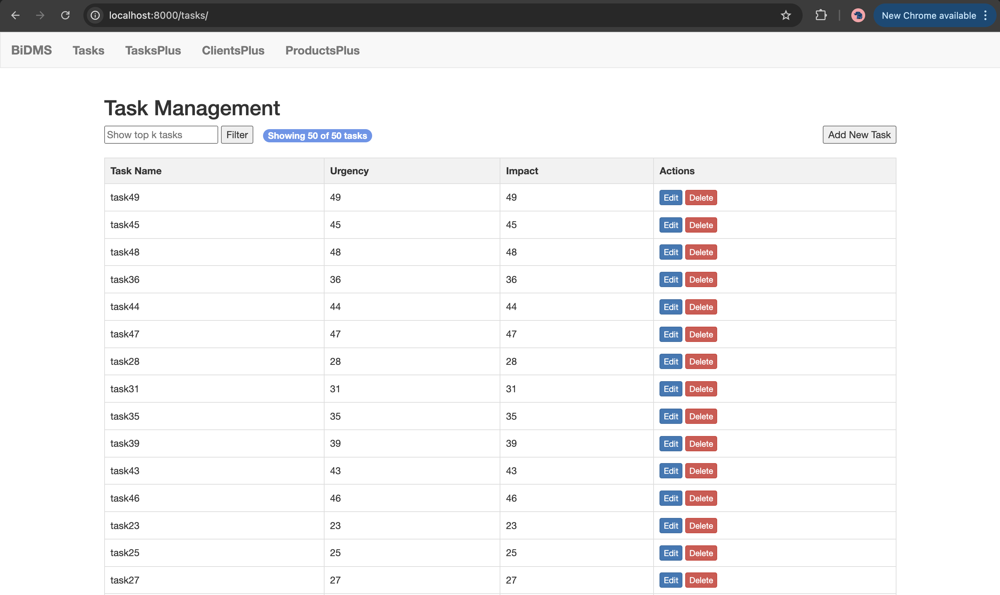
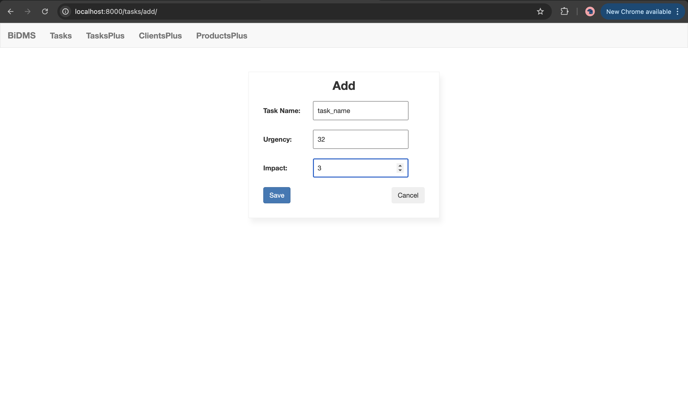
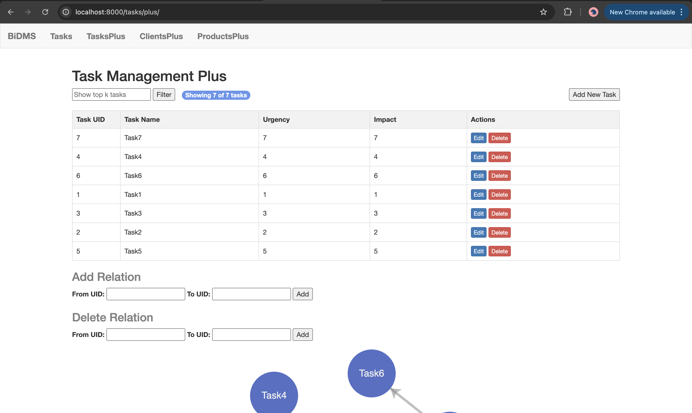
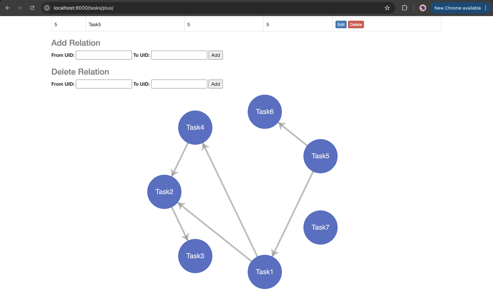
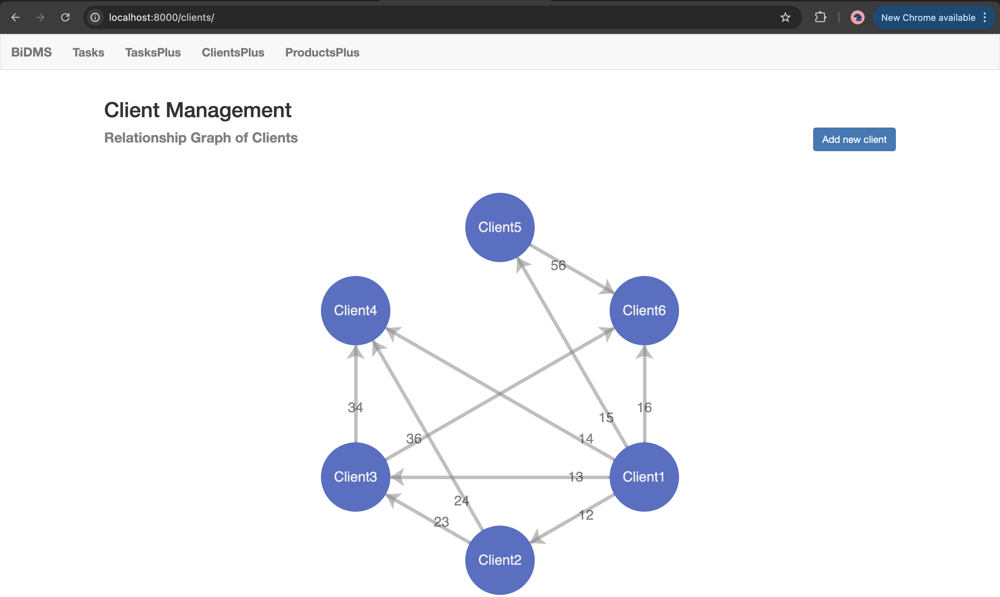
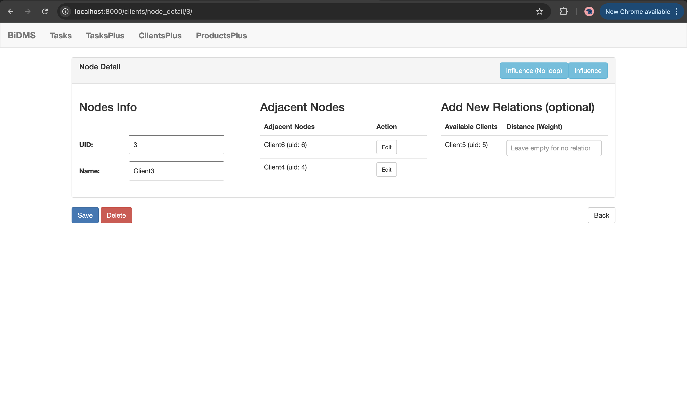
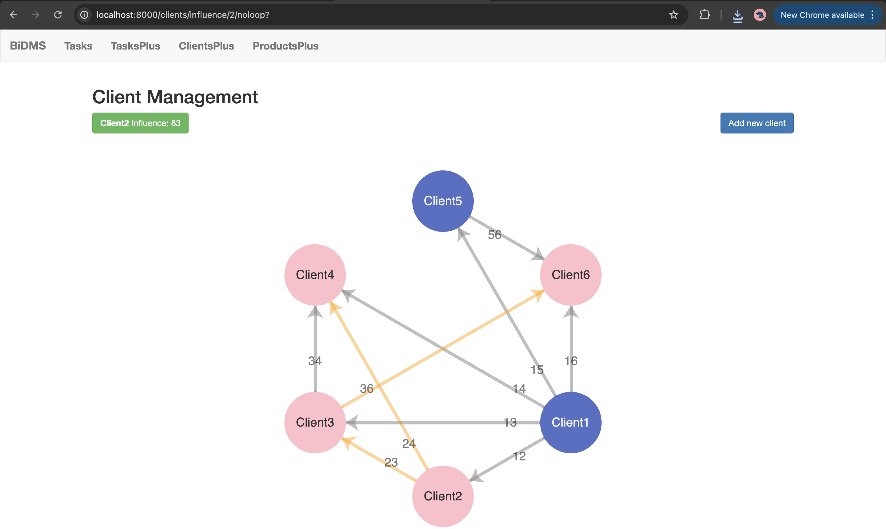
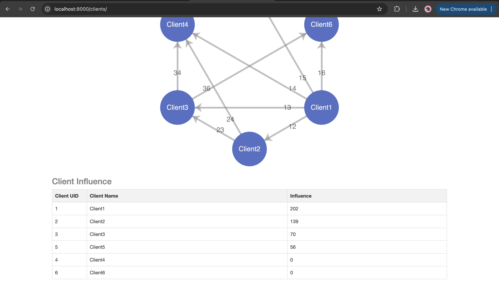
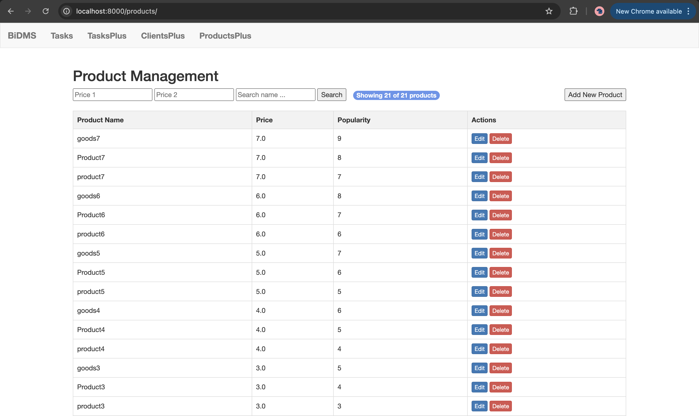
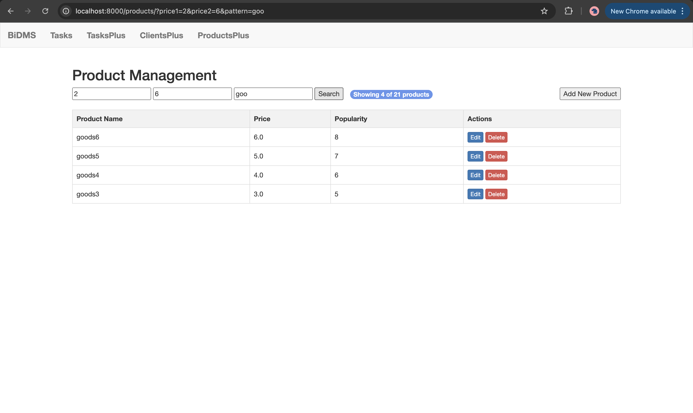

# 商业决策平台的智能数据管理系统 DSA-Project

> 《数据结构与算法导论》2025春季学期课程项目

本项目基于 `Python` 开发，为更好的展示效果，采用 `Django` 网页框架，开发了一款“数据驱动商业决策平台”。各个基础数据结构和算法均从零实现，本项目目标是尽可能的优化时间复杂度，并设计数据存储方式以适配更广泛的开发情景。

## 0 下载与本地测试

首先介绍如何下载本项目并进行本地测试：

1. 进入任意用于存放本项目的文件夹

```bash
cd <DIR>
```

2. 利用 `git` 工具远程克隆

```bash
git clone https://github.com/isKage/bidms-dsa-pj.git
```

3. 进入项目目录，下载依赖（可以先创建虚拟环境）

```bash
pip install -r requirements.txt
```

4. 进入 `data` 文件夹，创建空数据文件，用以存储数据

```bash
touch data/{01tasks.csv,02client_uid_name.csv,03clients.json,04products.csv,07tasks_graph.json,08tasks_plus.csv}
```

5. 运行程序

```bash
python manage.py runserver
```

打开浏览器，前往本地 `8000` 端口查看 http://127.0.0.1:8000/ 。

## 1 项目介绍

### 1.1 项目背景

你是一家新兴的“数据驱动商业决策平台”的员工，公司要求你帮助设计其底层数据处理模块。你需要设计一个系统支撑平台的智能化运行，该系统存储的数据包括：

- 营销任务：每一条任务存储任务名称、紧急度、影响力；
- 一个表示客户之间关系的加权有向图：图中的每个点表示一个客户并存储客户名称；
- 所有商品的数据：每一条数据存储商品名称、价格、热度。

### 1.2 项目文件结构

本项目基于 `Python` 开发，为更好的展示效果，采用 `Django` 网页框架，开发了一款“数据驱动商业决策平台”网页雏形，项目文件结构见下：

```bash
tree ./ -L 1
BiDms/
├── BiDms
├── LICENSE
├── README.md		# 说明文档
├── core			# [核心功能实现]
├── data			# 存储数据文件
└── manage.py		# Django 
```

其中【核心功能】实现的代码见 `core` 库

```bash
tree ./core/ -L 1
core/
├── __init__.py
├── admin.py
├── apps.py
├── migrations
├── models.py
├── services		# [核心功能具体实现]
├── static			# 静态文件样式等, css & js
├── templates		# 页面 HTML
├── tests
├── tests.py
├── urls.py
└── views			# Django 视图函数, 实现前后端交互和后端逻辑
```

核心功能具体实现 `services` 结构

```bash
tree ./core/services -L 1
./core/services
├── __init__.py
├── data_structures				# [项目使用的所有数据结构, 从零实现]
├── readme.md					# 补充说明文档, 解释如何测试
├── task_service.py				# 1. 实现营销任务优先调度功能
├── task_service_plus.py		# 1*. 实现营销任务优先调度功能 PLUS
├── client_service.py			# 2*. 客户网络与影响力传播分析 PLUS
├── product_service.py			# 3. 商品数据检索
└── product_service_plus.py		# 3*. 商品数据检索 PLUS
```

本项目实现的各类数据结构 `data_structures`

```bash
tree ./core/services/data_structures
./core/services/data_structures
├── __init__.py
├── b_plus_tree.py			# B+ 树
├── b_tree.py				# B 树
├── b_tree_disk.py			# B 树, 磁盘 I/O 处理
├── graph.py				# 图
├── heap.py					# 堆
├── map.py					# 映射
├── search_tree.py			# 搜索树 (AVL 树等实现的有序映射)
├── test_data/					# 存储测试用数据
└── utils						# 更基础的类和数据结构
    ├── __init__.py
    ├── adaptable_heap_priority_queue.py		# 基于堆实现的优先级队列
    ├── array_stack.py							# 基于数组实现的栈
    ├── linked_binary_tree.py					# 基于双向链表实现的树
    ├── map_base.py								# 映射的基类 ADT
    └── pattern_matching.py						# 模式匹配
```

## 2 Task 任务管理

实现营销任务优先调度功能：该功能维护一个存储所有营销任务的结构。该结构需要有基础的插入、删除、更改营销任务的功能，并支持执行优先级最高的任务、查看优先级最高的前 k 个任务等高级操作。其中，一个任务的优先级定义为其紧急度和影响力的乘积。

简单来说，对于一个任务，我们需要维护至少 3 个字段 `name, urgency, impact` ，并实现高效的增删改查功能，以及查看优先级最高的前 k 个任务。其中，一个任务的优先级定义为其紧急度和影响力的乘积。

### 2.1 数据存储方式

本项目提出对每一个任务，都多维护一个字段 `uid` 表示该任务的唯一标识符。且 uid 满足主键的特征，即不可重复，且具有自增属性。

本地存储：于是，我们可以用一个简单的表格存储任务列表：

```text
uid,name,urgency,impact
1,task1,1,1
...
```

内存存储：对于这样的一个任务列表，我们采用**优先级队列**的方式读入这些数据。为了能在 O(1) 内查看某节点，故该优先级队列增加了定位器。

> 本地存储文件见  [01tasks.csv](data/01tasks.csv) ，含有定位器的基于堆实现的优先级队列代码见  [heap.py](core/services/data_structures/heap.py) 。

>【Tip】特别需要注意的是，我们使用 uid 作为任务的标识，可以极大提高存储效率。对于大数据，无论需要存储的对象有多少个属性/字段，我们的数据结构只需要存储 uid 即可（后面的问题会用到这个优势），而且使用 uid 也避免了出现重复名称的对象。所以，后面功能的实现，数据均多维护一个字段 `uid` 。

### 2.2 功能实现

高效的增删改查功能，以及查看优先级最高的前 k 个任务的代码可见  [task_service.py](core/services/task_service.py) 。我们定义一个类 `TaskService` 用来维护整个任务列表，并实现功能。

初始化时：

```python
class TaskService:
    """任务服务对象"""
    
	def __init__(self, file_path=os.path.join(settings.DATA_DIR, '01tasks.csv')):
        """初始化, 读取数据库中数据"""
        self.pq = AdaptableHeapPriorityQueue()  # 优先级队列, 实现了定位器
        self.locators = ProbeHashMap()  # 定位, {uid: Locator 类}
        self.task_data_file = file_path
        self._max_uid = 0  # 主键, 自增
        self._load_tasks(self.task_data_file)  # 加载数据
```

- `self.pq` 用来存储任务数据，因为本文任务数据量较少，故全部存储 `key=-urgency * impact, value=(uid, task_name, urgency, impact)` （这里的优先级队列是最小堆实现，即根节点存储最小键，为了适用于本项目，实现负热度）。

- `self.locators` 使用哈希表，存储 `uid` 到优先级队列中的对象，即 `{uid: Locator}` （`ProbeHashMap` 哈希表映射类的实现见  [map.py](core/services/data_structures/map.py) ）。
- `self.task_data_file` 数据存储文件路径。
- `self._max_uid` 存储当前最大 uid ，用于实现 uid 的自增功能。
- `self._load_tasks()` 加载原始的本地数据，构建优先级队列，同时记录当前最大 uid 。

其他具体方法实现见代码文件  [task_service.py](core/services/task_service.py) 。

> 【Tip】uid 的自增：当添加一个新任务时，获取当前最大 uid 加 1 之后作为新任务的 uid 同时 `self._max_uid += 1` ；但当删除任务时，并不改变最大 uid 。这会导致在反复删增的过程中， uid 并不是连续自增的，这会导致 uid 最终越来越多，超出范围吗？答案是否定的。对于 Python 其 int 类型是动态的，理论上无限制。即使考虑到采用传统 C 中的 unsigned int ，若采用 4 字节存储，最大可到 $2^{32} - 1$ 是个 42.9 亿量级的数，一般任何场景下的任务都不会达到这个数。

增：使用优先级队列的插入；

删：使用 uid 快速定位后删除；

改：改 name 则只需修改值；修改键，则采用先删后加的方式；

查：使用 uid 快速查找。

top k ：方法一是不断的从堆顶出堆；方法二是建立一个 k-heap ，然后和剩下元素进行比较，不断进行出堆入堆操作。

### 2.3 算法分析

首先声明，动态数组的摊销不再特地说明。因为是基于堆实现的优先级队列，所以对于 $n$ 个任务的情况，增（插入）和删除的时间复杂度为 $O(\log n)$ 。而改值，使用 uid 进行 $O(1)$ 的查找，对于改键，则需要 $O(2\log n) = O(\log n)$ 。查找在基于 uid 映射的方法只需 $O(1)$ 。

top-k ：

- 方法一，每一次堆顶元素（最小），复杂度为 $O(\log n)$ ，总共出堆 $k$ 次，故复杂度为 $O(k\log n)$ 。

- 方法二，先将 $k$ 个元素建堆 ，复杂度为 $O(k)$ 。然后将剩下的 $n-k$ 个元素逐个和堆顶元素比较，如果更大，则替换掉栈顶元素，同时进行向下冒泡 downheap 使得满足 heap-order 性质，这一步的复杂度为 $O((n-k)\cdot \log k)$ 。最后再逐个出堆，总共的时间复杂度为 $O(k + (n-k)\cdot \log k + k\log k) \sim O(n\cdot \log k)$ 。若不采用自底向上建堆，则为 $O(k\log k + (n-k)\log k + k \log k) \sim O(n\log k)$ 。

所以实现时，可以选取一个临界点，实现复杂度为 $\min \{ O(k\log n),\ O(n\log k) \}$ 。

### 2.4 功能展示

使用 Django 框架展示，视图函数代码文件见 [task_service.py](core/services/task_service.py) 。各个路由分发见代码 [urls.py](core/urls.py) 。





## 3 Task Plus 任务管理拓展

拓展：如果这些营销任务之间存在前置依赖，即一个任务必须在另一个任务之后完成，应该如何完善此功能？任务之间的依赖关系使用一个有向图表示。

简单来说，无需修改原数据存储方式，只需增加一个图数据存储任务直接的联系即可。我们采用有向图，每个节点存储任务的 uid ，用 A 指向 B 表示 B 是 A 的前置。那么这个图的要求就是，不能存在有向循环/有向环，即图为 DAG （有向非循环图）。

### 3.1 数据存储方式

图采用邻接映射实现，所以可以采用 json 格式文件存储图结构，而每个图的节点只存储 uid ，其他数据再之前的优先级队列中已经存储完成。具体 uid 对应的数据也可以在本地 csv 文件中查询（未保护数据，此处的 csv 文件与之前的 csv 文件隔离，此处的数据存储在文件  [08tasks_plus.csv](data/08tasks_plus.csv) ）。

存储任务之间的关系图，存储在文件  [07tasks_graph.json](data/07tasks_graph.json)  中。图 `Graph` 类的实现见代码  [graph.py](core/services/data_structures/graph.py) 。

```json
{
  "directed": true,
  "vertices": [
    1,
    2, ...
  ],
  "edges": [
    {
      "u": 1,
      "v": 2,
      "weight": null
    }, ...
  ]
}
```

### 3.2 功能实现

完整代码见  [task_service_plus.py](core/services/task_service_plus.py) ，下面是初始化代码：首先，继承之前实现的 `TaskService` 类，并在初始化时先调用父类初始化方法。

```python
class TaskServicePlus(TaskService):
    """升级版: 加入任务前后关系"""

    def __init__(self):
        super().__init__(os.path.join(settings.DATA_DIR, "08tasks_plus.csv"))
        self.g = Graph(directed=True)  # 存储优先关系图 A -> B 代表 B 先于 A
        self.task_relation_graph_file = os.path.join(settings.DATA_DIR, "07tasks_graph.json")

        # 定位器, 存储 {uid: Graph.Vertex 类}
        self._load_relation()  # 自主生成定位器 self.uid_vertex
```

- `self.g` 任务关系有向图。
- `self.task_relation_graph_file` 图的存储文件路径。
- `self._load_relation()` 读入图结构，并定义一个定位器 `self.uid_vertex = {uid: Vertex 类}` 。

此时的增删改查功能，在基于父类已经实现的基础上，添加图的操作。特别地，对于任务的前置关系，新的 `TaskServicePlus` 类实现了 `add_relation()` 和 `remove_relation()` 方法，它们通过 uid 来增加和删除边。

对于有向无环图的限制判断，我们采用**拓扑排序**算法，完整实现可见 [graph.py](core/services/data_structures/graph.py) 。

```python
def topological_sort(g: Graph):
    """返回拓扑排序, 即不存在排序在后的点指向排序在前的点
    若存在有向环, 则返回的序列不包含图中所有点
    """
    topo = []  # 按拓扑顺序存储 Vertex 类
    ready = []  # 存储满足条件的点, 即不再影响图的成环性 (栈 stack)
    incount = {}  # 存储每个点的入度, 实时更新

    # 1. 获取所有点, 记录 {Vertex: in-degree}
    for u in g.vertices():
        incount[u] = g.degree(u, False)
        if incount[u] == 0:  # 入度为 0 可以作为起始点, 不受其他影响
            ready.append(u)

    # 2. 对每个点处理, 清空 ready
    while len(ready) > 0:
        u = ready.pop()
        topo.append(u)
        # 获取 u 的邻接点
        for e in g.incident_edges(u):
            v = e.opposite(u)
            incount[v] -= 1  # 前一点已加入 topo 结果, 则 v 度减 1
            if incount[v] == 0:
                ready.append(v)  # 直到此时 v 也成为了"起点"
    return topo
```

添加边 uv ，当拓扑排序包含了所有点时，说明不含有向循环，否则不允许增加边 uv 。

### 3.3 算法分析

插入/删除边对于图来说均为 $O(1)$ ，对于点的插入为 $O(1)$ ，而点的删除需要删除所有邻边，故为 $O(\deg v)$ 。点的查找，使用定位器只需 $O(1)$ ，而这里边的查找是基于点，故仍然为 $O(1)$ 。

而拓扑排序的时间复杂度为 $O(n+m)$ 其中 $n$ 为点的个数（即任务数），$m$ 为边的个数（即任务关系数）。注意到，有无环是整个图的性质，一般而言最坏的情况下均要遍历整幅图。

除了拓扑排序，也可以使用遍历（BFS or DFS），例如对于点 u 和 v ，我们想判断 u -> v 相连后会不会出现环。可以检查此时是否有一条从 v 到 u 的路径，即从 u 开始向上遍历，如果上游存在 v 则相连会成环。注意到，遍历的复杂度也是 $O(n+m)$ 。

### 3.4 功能展示

使用 Django 框架展示，视图函数代码文件见 [tasks_plus.py](core/views/tasks_plus.py) 。各个路由分发见代码 [urls.py](core/urls.py) 。关系图前端使用 [ECharts](https://echarts.apache.org/zh/index.html) 前端的 `javascripts` 代码。





## 4 Client 客户管理

客户网络与影响力传播分析：该功能基于存储客户之间关系的加权有向图进行分析。请自行设计算法评估每一位客户的重要性，并寻找每一位客户能影响到的所有其他客户。

简单来说， 需要维护客户 `name` 字段和客户之间关系影响 `weight` 字段。同样，我们采用 uid 代表每一个客户，允许客户重名。使用有向图代表关系，A 指向 B 代表 A 对 B 有影响，不妨设客户之间只能单向影响，即不允许两点之间有 2 条边，即简单图（但允许成环）。

### 4.1 数据存储方式

与 Task Plus 的存储方式相同，json 文件存储图结构 [03clients.json](data/03clients.json) ，图的每个点存储 uid 图的边存储影响力。未存储客户的详细信息，使用 csv 文件存储 uid 和客户其他信息  [02client_uid_name.csv](data/02client_uid_name.csv) 。

### 4.2 功能实现

相比于之前的 task ，客户管理功能只需完成存储信息和关系即可，没有比较和优先级的需求，直接使用图即可完成。为了方便的实现 uid 到点 Vertex 类的映射，可以存储一个定位器 `self.locators = {uid: Vertex}` ，为了方便的实现 uid 到客户具体信息的映射，可以存储一个定位器 `self.uid_to_name = {uid: name}` 。

> 注意，uid 到客户信息的映射，也可以采用存储 `{uid: offset}` 其中 `offset` 为客户 uid 数据在磁盘中的偏移量，这样就可以实现超大量数据的快速搜索，而无需读入内存。这一想法的实现，可见后面实现 product 的磁盘管理。

完整代码见 [client_service.py](core/services/client_service.py) 。

而要查找被客户影响的其他所有客户，可以采用广度优先搜索 BFS 遍历全图，并计算沿路径的权重和作为其影响力。代码见 [graph.py](core/services/data_structures/graph.py) 。

```python
# ==================== 广度优先搜索 ====================
def BFS(g: Graph, s: Graph.Vertex, discovered: dict):
    """
    图 g 中任意顶点 s 的广度优先搜索
    :param g: 图 Graph 类
    :param s: 顶点 Graph.Vertex 类
    :param discovered: 字典, 存储探索结果 {s (Vertex 类): None}
    :return: 权重和
    """
    level = [s]  # 第一层, 只有初始顶点 s
    weight_sum = 0

    while len(level) > 0:
        next_level = []  # 下一层的顶点集
        for u in level:  # 遍历本层所有点
            for e in g.incident_edges(u):  # 对 u 遍历所有边 e
                v = e.opposite(u)  # 找到边 e 的另一个端点 v
                if v not in discovered:  # 若 v 未标记
                    discovered[v] = e  # 则标记边 e
                    weight_sum += e.element()
                    next_level.append(v)  # 且存储点 v

        level = next_level  # 更新当前层
    return weight_sum


def BFS_allow_loop(g: Graph, s: Graph.Vertex, discovered: list):
    """
    图 g 中任意顶点 s 的广度优先搜索, 允许成环
    :param g: 图 Graph 类
    :param s: 顶点 Graph.Vertex 类
    :param discovered: 列表, 存储探索结果 []
    :return: 权重和
    """
    level = [s]  # 第一层, 只有初始顶点 s
    weight_sum = 0

    while len(level) > 0:
        next_level = []  # 下一层的顶点集
        for u in level:  # 遍历本层所有点
            for e in g.incident_edges(u):  # 对 u 遍历所有边 e
                v = e.opposite(u)  # 找到边 e 的另一个端点 v
                discovered.append((v, e))  # 则标记边 e
                weight_sum += e.element()
                next_level.append(v)  # 且存储点 v

        level = next_level  # 更新当前层

    return weight_sum
    # discovered = [(Vertex, Edge), (B, e(from s to B)), ...]
```

### 4.3 算法分析

点和边的增删改查与 Task Plus 一致，这里不赘述。对于广度优先搜索，复杂度为 $O(n+m)$ ，其中 $n$ 为客户数, $m$ 为关系数。

> 【Tip】之前的 Task 关系和这里的 Client 关系图均采用邻接表/映射实现，并存储在 json 文件中。如此加载数据，重新构建图十分方便，但也浪费了许多空间。可以考虑存储有向边集合到文件中，每次加载读取时，从边集加载重构图结构。这样并不会消耗过多时间，只要在项目开始运行时就先加载数据，项目结束时才存储数据到文件，如此重构图的过程只进行了一次。

### 4.4 功能展示

使用 Django 框架展示，视图函数代码文件见 [clients.py](core/views/clients.py) 。各个路由分发见代码 [urls.py](core/urls.py) 。关系图前端使用 [ECharts](https://echarts.apache.org/zh/index.html) 前端的 `javascripts` 代码。







## 5 Client Plus 客户管理拓展

拓展：当图中两个客户间的路径过长或路径影响力过小时，这两个客户间的影响可以忽略不计。在此基础上，完善这一部分功能。

### 5.1 功能实现

总影响力有多种定义：

- 所能到达的所有路径的权重和
- 所有最大路路长的平均

之前的功能已经实现了第一个定义——所能到达的所有路径的权重和。采用 BFS 计算，其中 `BFS_allow_loop()` 函数甚至计算了能影响的客户对同一客户的影响。即 A 对 B 和 C 有影响，B 对 C 有影响，`BFS_allow_loop` 计算了 (AB + AC) + BC 。

下面我们实现第二章定义——所有最大路路长的平均。

> 注意：最长/短是等价的，只需添加正负号即可。

**方法一：Dijkstra 算法**

修改 Dijkstra 算法，使得当此时的权重和超过某个阈值，则停止向下探索。即实现了“路径过长或路径影响力过小时，这两个客户间的影响可以忽略不计”（[graph.py](core/services/data_structures/graph.py)）。

```python
# ==================== Dijkstra 算法最短路 ====================
def shortest_path_lengths(g: Graph, src: Graph.Vertex, threshold=None) -> dict:
    """
    最短路径问题: Dijkstra 算法
    :param g: 图 Graph 类
    :param src: 源点 Graph.Vertex 类
    :param threshold: 阈值
    :return: 源点 src 到所有可达点 v 的最短距离 dict: {v: d[v]}
    """
    d = {}  # 记录所有点的标签 d[v]
    cloud = {}  # 存储最终结果 {v: d[v]} 在云内的标签 (即最终最短路)
    pq = AdaptableHeapPriorityQueue()  # 优先级队列, 能够 O(1) 找到特定点, 值 (点 v)为 locator 字典的键
    pqlocator = {}  # 存储点 v 在优先级队列中的位置 {v: loc of v in pq (AdaptableHeapPriorityQueue.Locator 类)}

    # 初始化所有点 v 的标签 d[v]
    for v in g.vertices():
        if v is src:
            d[v] = 0  # 源点为 0
        else:
            d[v] = float('inf')  # 暂时记为正无穷大
        pqlocator[v] = pq.add(d[v], v)  # (最短路 d[v], 点 v) 放入优先级队列, 同时记录位置在 pqlocator

    while not pq.is_empty():
        key, u = pq.remove_min()  # 取出云外最小路 min d[v] out of cloud
        cloud[u] = key  # 放入云内 cloud[u] = key 因为存的时候 key = d[u]
        del pqlocator[u]  # pqlocator 删去点 u 在优先级队列里的位置

        for e in g.incident_edges(u):  # 所有通向点 u 的边 e
            v = e.opposite(u)  # 对面的点 v
            if v not in cloud:  # 若 v 不在云里
                wgt = e.element()  # 边权重
                new_dist = d[u] + wgt
                # 阈值判断
                if threshold is not None and new_dist >= threshold:
                    continue  # 超过阈值
                # 否则, 正常 Dijkstra
                if new_dist < d[v]:
                    d[v] = new_dist
                    pq.update(pqlocator[v], d[v], v)
    return cloud
```

**方法二：Floyd Warshall 算法**

我们也可以基于**统计推断**的思想，先利用 Floyd Warshall 算法计算各点之间的最短/大路，然后进行统计分析（[graph.py](core/services/data_structures/graph.py)）。

```python
# ==================== Floyd Warshall 算法最短路 ====================
def floyd_warshall_shortest_path(g: Graph) -> dict:
    """
    使用 Floyd-Warshall 算法计算图中所有顶点对的最短路径距离
    :param g: 图 Graph 类
    :return: 返回一个字典 {u: {v: distance}}
    其中 distance 是 u 到 v 的最短距离
    如果 u 和 v 之间不可达 distance = float('inf')
    """
    verts = list(g.vertices())  # 获取所有顶点
    n = len(verts)

    # 初始化距离字典, 格式为 dist[u][v] = distance
    dist = {u: {v: float('inf') for v in verts} for u in verts}

    # 设置对角线为 0
    for u in verts:
        dist[u][u] = 0

    # 初始化直接相连的边
    for u in verts:
        for v in verts:
            edge = g.get_edge(u, v)
            if edge is not None:
                dist[u][v] = edge.element()

    # Floyd-Warshall 算法
    for k in verts:  # 中间点 k
        for u in verts:  # 起点 u
            for v in verts:  # 终点 v
                # 如果经过 k 的路径更短，则更新
                if dist[u][k] + dist[k][v] < dist[u][v]:
                    dist[u][v] = dist[u][k] + dist[k][v]

    return dist
```

统计分析：

设 $X_{ij}$ 代表客户 $i$ 对客户 $j$ 的最大影响力大小。假设 $X_{ij} \sim N(\mu_i,\ \sigma_i^2)$ ，且 $X_{ij}$ 相互独立对于 $\forall\ j = 1,\ 2,\ \cdots,\ n$ 。则有：

```math
\hat{\mu}_{i,\ unb} = \frac{1}{n}\sum_{j=1}^n X_{ij} = \bar{X_i}
```

```math
\hat{\sigma^2}_{i,\ unb} = \frac{1}{n-1}\sum_{j=1}^n (X_{ij} - \bar{X_i})^2 = S^2
```

而：

```math
\frac{X_{ij} - \mu_i}{\sigma_i} \sim N(0,\ 1)
```

从而有：

```math
P\left( z_{\alpha/2} < \frac{X_{ij} - \mu_i}{\sigma_i} < z_{1-\alpha/2} \right) = 1 - \alpha
```

我们定义 $X_{ij} \leq \mu_i + z_{\alpha/2}\cdot \sigma_i$ 为异常小的，可以忽略不计。于是根据已有的数据 $X_{ij}\quad \forall j = 1,\ 2,\ \cdots,\ n$ 可以得到被忽略的数据 $X^{ign}_{ij}$（基于对 $\mu_i$ 和 $\sigma$ 的估计）：

```math
X^{ign}_{ij} \leq \left(\frac{1}{n}\sum_{j=1}^n X_{ij}\right) + z_{\alpha/2}\cdot  \left( \frac{1}{n-1}\sum_{j=1}^n (X_{ij} - \bar{X_i})^2\right)
```

代码实现可见 [client_service.py](core/services/client_service.py) 的 `ClientService.all_influence()` 方法。

### 5.2 算法分析

方法一：Dijkstra 算法使用优先级队列堆实现的复杂度为 $O(n+m)\log n$ 而我们需要对 $n$ 个客户使用，故复杂度为 $O(n(n+m)\log n)$ 。

方法二：Floyd Warshall 算法复杂度为 $O(n^3)$ 。

当图稀疏时，$O(n(n+m)\log n) = O(n^2 \log n)$ 肯定是优于 $O(n^3)$ 。但当图稠密时， $O(n(n+m)\log n) = O(n \cdot n^2 \log n) = O(n^3\log n)$ 是劣于 $O(n^3)$ 。

### 5.3 功能展示

使用 Django 框架展示，视图函数代码文件见 [clients.py](core/views/clients.py) 。各个路由分发见代码 [urls.py](core/urls.py) 。关系图前端使用 [ECharts](https://echarts.apache.org/zh/index.html) 前端的 `javascripts` 代码。（直接在之前的 Client 管理基础上添加了计算并排序影响力功能）。



## 6 Product 商品管理

商品数据检索：该功能维护一个管理所有商品的结构。该结构需要有基础的插入、删除、更改商品信息的功能，并支持寻找任意价格范围内的所有商品的操作。请实现该结构。实际使用过程中，当用户在搜索框中输入商品名称的一小部分前缀时，该平台将自动推送符合该前缀且热度较高的几个商品。请实现该功能。

> 在 Product Plus 拓展部分，我们使用新的数据结构来实现内存不足的情况。

简单来说，我们需要维护一个商品的 `name, price, popularity` 字段，同样我们维护一个 `uid` 作为唯一标识符，实现增删改查，并返回任意 price 区间的数据，按照 popularity 排序。同时实现字符串前缀匹配问题（这里的前缀问题改为是否包含搜索的字符串，本质都是模式匹配问题）。

### 6.1 数据存储方式

类似 Task 基础功能，使用一个 csv 文件存储每个商品信息

```text
uid,name,price,popularity
1,product1,100.21,41
...
```

内存数据：读入数据，存储在一个有序映射 AVL 树（二叉搜索树），这里的 AVL 树的键存一个特殊的对象 `ProductKey` ，而节点值为一个哈希表，作为一个桶，存储多个 `Product` 对象。

### 6.2 功能实现

#### 6.2.1 Product 对象

考虑一种情况：我们需要按照 price 范围返回对象，所以 AVL 树的键应该是 price 相关的数据。但二叉搜索树如何处理键相同的问题？我们使用的 `AVLTreeMap` 类（ [search_tree.py](core/services/data_structures/search_tree.py) ）是一个有序映射，映射则不允许键相同。所以一个解决方法就是用桶 Bucket 的思想。

每个搜索树节点上存储的不是一个 `Product` 类，而是一个哈希表，哈希表中存储着多个商品，形如 `{uid: Product}` 。所以我们建立的 `Product` 类处理维护 `uid,name,price,popularity` 还需要维护一个 `self.bucket` 用来表示当前商品属于哪个桶。

除此之外，直接将 price 作为键也是一个不好的选择。其一，price 为浮点数，浮点数的 `==` 运算精度有限，简单来说就是 float 类型**全序性质**不佳。其二，注意到除了 price ，热度 popularity 也是排序的标准之一，简单来说，这是一个**字典序排序**。其三，目前只有 2 个属性可用来排序，未来面对更复杂的情况，则无法使用，代码可拓展性差。

所以，我们可以定义一个**键类** 例如本例的 `Product.ProductKey` 类，使其满足全序性质（定义 `__eq__, __lt__`），同时定义哈希函数（`__hash__`），使其具有充当键的完备性和可拓展性。

```python
class Product:
    """存储每一个商品信息"""

    # -------------------- nested ProductKey --------------------
    class ProductKey:
        """商品比较的键, 实现全序属性"""

        def __init__(self, sort_key: list):
            self._key = sort_key
		...

    # -------------------- 商品 Product 类 --------------------
    def __init__(self, uid: int, name: str, sort_key: list, bucket: None):
        """
        初始化商品对象, 代表了唯一的一个商品
        :param uid: 唯一主键
        :param name: 商品名称
        :param sort_key: 用于排序比较的键 [price] or [price, popularity]
        :param bucket: 存储桶的地址
        """
        self._uid = uid  # 唯一主键
        self._name = name  # 商品名称
        self._key = self.ProductKey(sort_key)  # 用于排序比较的键 [price] or [price, popularity]
        self._bucket = bucket  # 存储桶地址
```

#### 6.2.2 基础功能实现

完整代码见 [product_service.py](core/services/product_service.py) 。

```python
class ProductService:
    """商品服务类"""

    def __init__(self):
        self.avl = AVLTreeMap()  # 存储 {ProductKey: {uid: Product, ...}, ...}
        self.uid_map = ProbeHashMap()  # {uid: Product 类}
        self.product_data_file = os.path.join(settings.DATA_DIR, '04products.csv')
        self._max_uid = 0
        self._n = 0
        self._load_data()  # 读取数据
```

- `self.avl` 基于 AVL 树的有序映射。
- `self.uid_map` 使用 uid 快速找到 Product 类。

插入：获取 uid 并实例化一个 `Product` 对象，查看是否 AVL 树的键中是否已经有 `ProductKey` 。没有则新建桶，并插入；有则直接插入。

删除：根据 uid 和 `self.uid_map` 快速找到 Product 类，并获取 bucket ，从桶中删去，检查桶是否为空，空则从 AVL 树中删去键为此的节点。

更新：若只更新与键无关的值，只需找到 Product 类修改即可，对 AVL 不操作；否则先删除后插入。

查看：根据 uid 查看。

price 范围：找到 `start` 位置，然后中序遍历，逐个返回即可，直到 `end`。

#### 6.2.3 模式匹配

**Knuth-Morris-Pratt 算法：**

- 方法一：逐个比较商品 name 和 pattern 。
- 方法二：对于目标搜索 pattern ，先将所有商品的 name 使用特殊字符（例如 `"*"`）拼接成一个长字符串，然后进行匹配 pattern ，返回所有匹配成功的位置。

本项目采用方法二，性能分析见后。

> 【思考】当 name 列表过大，是否会浪费过多空间。是否可以考虑使用霍夫曼编码，压缩 text 文本和 pattern 字符串，对二进制数按位计算，一次节省空间。例如，ASCII 码一个字符占据 1 个字节，但在霍夫曼编码的情况下能压缩。可以尝试构造一个长数组，分配空间为 `len * 1 byte` （C 语言中最小寻址为 1 字节），那么 1 字节可以存储不止 1 个字符。

### 6.3 算法分析

设商品数为 $n$ ，则 AVL 树高度大约为 $h = O(\log n)$ 。搜索的复杂度为 $O(\log n)$ 。插入和删除也为 $O(\log n)$ 。更新操作最坏也是插入和删除的组合，仍然为对数时间。查找范围为 $O(s + \log n)$ 其中 $s$ 为查找范围中含有的商品数。

模式匹配：设商品名大约均为 $m$ 长，匹配的字符串长为 $p \leq m$ ，总共 $n$ 个商品。如果采用方法一，长为 m 的匹配复杂度为 $O(m + p)$，循环 n 次，最终复杂度为 $O(n(m + p))$ ，方法二先遍历拼接字符串，复杂度为 $O(n)$ ，然后对整体匹配，复杂度为 $O(nm + p)$ ，最终复杂度为 $O(n +nm + p)$ 。二者的差：

```math
n(m+p) - (n +nm + p) = np-n-p = (n-1)(p-1) - 1 \geq 0
```

当 $n,\ p > 1$ 时，故方法二更优。

### 6.4 功能展示

使用 Django 框架展示，视图函数代码文件见 [products.py](core/views/products.py) 。各个路由分发见代码 [urls.py](core/urls.py) 。





## 7 Product Plus 商品管理拓展

实际上，由于该平台上的商品数目过多，所有的商品数据存储在磁盘上，且无法被全部读取到内存后进行处理。这时，普通的二叉搜索树性能无法令人满意。请自行决定使用何种数据结构存储大量的商品数据，并实现该数据结构。要求该数据结构同样支持高效的插入、删除、更改、搜索等功能。

计算机系统提供多种数据存储方式：**基于芯片的主存（内存） & 基于磁盘的辅存**。主存存储正在运行的程序和数据，断电后数据丢失，存储数据比辅存少，但计算速度极快。辅存基于磁盘，读取依靠机械运动，可存储数据巨大，但读写速度非常慢（比内存慢 10 万倍）。（为提高效率，磁盘一般按块 block 读入，而内存会实现分页 page 操作，实现与磁盘块的对齐，当内存访问不到某个对象，触发缺页异常，会将磁盘读取的块数据按照页读入内存）。

所以在考虑这个问题时，我们需要将磁盘读取的时间考虑在内。

### 7.1 B 树与 B+ 树

> 更多内容可以参考教材 [《算法导论》](https://book.douban.com/subject/1152912/) 第五部分-高级数据结构-第 18 章-B树。

**B 树**是一种满足以下条件的树结构：

- 多路分支：每个节点最多有 t 个子节点（t 阶）。
- 平衡性：所有叶子节点位于同一层。

- 子节点：

    - 根节点至少有 2 个子节点（除非它是叶子节点）。

    - 内部节点至少有 $[t/2]$ 个子节点。

    - 每个节点最多有 $t$ 个子节点。

- 键：

    - 一个节点最多存储 $t−1$ 个键。

    - 非根节点至少有 $[t/2]−1$ 个键。

对于 B 树而言，每个节点（对应的磁盘位置）都可以存储数据。每一个节点内，键值满足从左到右主键变大。位于键 k1 和 k2 之间的子节点的键满足 $k1 \leq k \leq k2$ 。

**B + 树**是 B 树的变种，在 B 树的基础上进行了一些变化：

- 内部节点（对应的磁盘位置）不可存储数据，只存储子节点的索引；叶子节点（对应的磁盘位置）才存储数据。
- 叶子节点多维护一个指向下一个叶子节点的索引。

> 可以简单地把这里的键 Key 理解为数据，或者理解为形如：`(key, field1, field2, ...)` 其中 key 具有全序性质。

代码 [b_plus_tree.py](core/services/data_structures/b_plus_tree.py) 和  [product_service_plus.py](core/services/product_service_plus.py) 实现了 B+ 树 `BPlusTree` 类以及结合具体 Product 商品数据的管理（增删改查+范围搜索），但采用的是一次性将所有节点索引读入内存，叶子节点存储了具体数据的磁盘索引，并不是传统意义上的 B+ 树。

测试性能：

```python
All Data: 101132
Add one time: 0.02136499881744385
Search one time: 0.00011587142944335938
```

>  [b_plus_tree.py](core/services/data_structures/b_plus_tree.py) 代码借用了 AI 生成工具。

### 7.2 数据读取与磁盘管理

下面以 B 树为例，结合本项目的商品数据，具体介绍如何使用 B 树来处理超大量的数据。

>  [b_tree.py](core/services/data_structures/b_tree.py) 代码实现了基于内存的经典 B 树，不涉及磁盘管理，代码来自 [Geeksforgeeks](https://www.geeksforgeeks.org/introduction-of-b-tree-2/) 。

本项目实现了基于磁盘存储的 B 树，代码见  [b_tree_disk.py](core/services/data_structures/b_tree_disk.py) ，实现了插入和搜索功能，其他功能同理。

#### 7.2.1 数据存储和读取方式

我们将数据存储在二进制文件 [btree.db](core/services/data_structures/test_data/btree.db) 中，具体存储的对象为一个个 B 树的节点。

对每一个节点，我们需要存储：

- `is_leaf` 是否为叶子节点
- 键 `key` 例如这里的 price 
- 子节点索引 `children` 此处为子节点在磁盘中的偏移量 offset 
- 当前节点的偏移量 `offset` （只有根节点的 offset 需要存储在磁盘上，其他节点的 offset 可以根据父节点的 children 获取）
- 以及当前节点的实际键个数 `n`

```python
class DiskBTreeNode:
    """B 树的节点"""
    
    def __init__(self, is_leaf=True, keys=None, children=None, offset=None, n=0):
        self.is_leaf = is_leaf
        self.keys = [0] * MAX_KEYS if keys is None else keys  # key e.g. uid
        self.children = [None] * CHILDREN_SIZE if children is None else children  # 下一节点的偏移量
        self.offset = offset  # 当前节点的文件偏移位置
        self.n = n  # Current number of keys
```

对每一个节点，我们分配固定长度 bit 的磁盘空间用于存储：

- `is_leaf` 1 bit 。
- `keys` 每一个 key 分 `KEY_SIZE = 8` 字节（64 bit），总共预留 `MAX_KEYS = 2 * T - 1` 个 key （8 字节）的空间。
- `children` 与 key 类似，每个分 `OFFSET_SIZE = 8` 字节，预留 `CHILDREN_SIZE = MAX_KEYS + 1` 即 T + 1 个 8 字节空间。
- `n` 预留 8 字节空间。

> `self.offset` 存储的是当前节点在磁盘中的偏移，即第 `offset // page` 页的第 `offset % page` 个字节处，预留 8 字节空间。可以简单理解为磁盘上旋臂需要提前旋转的弧度。

```python
    def to_bytes(self):
        """序列化节点为字节"""
        data = bytearray(NODE_SIZE)
        data[0] = 1 if self.is_leaf else 0

        # 编码 keys
        for i, key in enumerate(self.keys):
            struct.pack_into("q", data, 1 + i * KEY_SIZE, key)  # 'q' 表示 8 字节整数

        # 编码 children
        for i, child in enumerate(self.children):
            child = child if child is not None else -1
            struct.pack_into("q", data, 1 + MAX_KEYS * KEY_SIZE + i * OFFSET_SIZE, child)  # 'q' 表示 8 字节整数

        struct.pack_into("q", data, NODE_SIZE - 8, self.n)

        return bytes(data)

```

如何读取？只要知道节点的 `offset` 就可以定位到正确的位置，向后读取固定长度，然后解析为对象即可。

> 【Tip】这里其实还要完善，磁盘读取数据按照块 block 读取，一次只读一个节点显然是不合理的。一个 block 块可能包含了多个节点数据，可以将相近节点放在磁盘相近位置，读取时就可以同时解析并等待内存读取，此时“邻居”被访问的概率更高，可进一步提高效率。对于一个节点中存储的数据非常大，也可以考虑将一个节点填满整个 block / page 大小。

```python
def read_node(cls, offset):
    with open(FILENAME, 'rb') as f:
        f.seek(offset)
        data = f.read(NODE_SIZE)
        node = from_bytes(data, offset)
        # print(f"Node @ offset={offset} is {node}")
        return node

def from_bytes(data, offset):
    """从字节解析节点"""
    is_leaf = bool(data[0])
    keys = [struct.unpack_from("q", data, 1 + i * KEY_SIZE)[0] for i in range(MAX_KEYS)]
    keys = [k for k in keys]

    children = [struct.unpack_from("q", data, 1 + MAX_KEYS * KEY_SIZE + i * OFFSET_SIZE)[0] for i in
                range(CHILDREN_SIZE)]
    children = [c if c != -1 else None for c in children]

    n = struct.unpack_from("q", data, NODE_SIZE - 8)[0]

    return DiskBTree.DiskBTreeNode(is_leaf, keys, children, offset, n)
```

而对于 B 树，还需要存储根节点的 offset ，从而构建树：

```python
class DiskBTree:
    """B 树"""
    
	def __init__(self, root_offset=None):
        if root_offset is None:
            self.root = None
        else:
            self.root = DiskBTree.read_node(root_offset)
```

#### 7.2.2 B 树的操作

在 B 树中搜索某一键值 k 的数据时，从根节点开始。

- 根据 `root_offset` 将根节点从磁盘中读进内存
- 在当前节点的 `keys` 中搜索 k ，这部分原理和二叉搜索树相同。找到则返回数据；否则根据 $key_i < k < key_j$  得到对应的 $children_i$ （存储的是下一节点的 offset）
- 根据偏移量，将下一节点从磁盘中读入内存，重复第二步
- 直到叶子节点都没找到，则代表搜索失败，返回 None

插入和删除操作都涉及对树结构进行变更，这里不多赘述。插入操作可见代码 [b_tree_disk.py](core/services/data_structures/b_tree_disk.py) （已实现基于磁盘的插入），删除操作可见 [b_tree.py](core/services/data_structures/b_tree.py) （基于内存）。

B 树的优点在于：并不是一次性把所有数据读入内存，而是将在 B 树中搜索路径上的节点数据读入内存，这就解决了大数据难以全部读入的困境。

> B+ 树内部节点不存储具体数据，即 `keys` 内只存储键值。上面的 B 树是简化之后的例子，实际上 B 树的 `keys` 应该存储类似 `Product` 类，而比较 key 值时应该比较的是 `ProductKey` 对象，所以分配空间应该要更大。
>
> B+ 树叶子节点和 B 树节点存储数据相当，不过多存储了一个指向下一叶子节点的 offset 。

### 7.3 代码测试结果展示

测试代码见  [b_tree_disk.py](core/services/data_structures/b_tree_disk.py) ，可直接运行。运行之后会在 [test_data](core/services/data_structures/test_data) 文件夹下生成存储数据的二进制文件 `btree.db` 。

```python
if __name__ == '__main__':
    # k > 0  # 因为将 0 作为了占位符
    print("One node size", NODE_SIZE)
    print("=" * 100, "\nInitial and Add Data\n", "-" * 100, sep="")
    tree = DiskBTree()
    keys_to_insert = [2, 3, 4, 5, 6, 12, 7, 8, 9, 10, 11, 15, 13]
    print(f"Add: {keys_to_insert}")
    for k in keys_to_insert:
        tree.insert(k)
    root_offset = tree.close()
    print(f"Root offset is {root_offset}")

    print("=" * 100, "\nLoad Data and Search\n", "-" * 100, sep="")
    tree = DiskBTree(root_offset)
    add_new = [1, 20, 30, 40, 50, 60, 70, 80, 90, 100, 21]
    print(f"Add new one: {add_new}")
    for k in add_new:
        tree.insert(k)

    print("The root: ", tree.root)
    print("Search 100: ", tree.search(100))
    print("Search 1: ", tree.search(1))
    print("Search 11: ", tree.search(11))
    root_offset = tree.close()
    print(f"Root offset is {root_offset}")
```

注意到，第一个节点 offset 肯定是 0 ，插入一些数据后（`T = 3`）根节点 offset = 97 Byte 恰好等于 `1 + 8 * 5 + 8 * 6 + 8 = 97` 的 1 倍，679 为 97 的 7 倍。

```python
One node size 97

=======================================================================
Initial and Add Data
-----------------------------------------------------------------------
Add: [2, 3, 4, 5, 6, 12, 7, 8, 9, 10, 11, 15, 13]

Root offset is 97


=======================================================================
Load Data and Search
-----------------------------------------------------------------------
Add new one: [1, 20, 30, 40, 50, 60, 70, 80, 90, 100, 21]

The root:  BTreeNode(is_leaf=False, keys=[11], num_keys=1, children=[97, 776, None, None, None, None], offset=679)

Search 100:  BTreeNode(is_leaf=True, keys=[70, 80, 100], num_keys=3, children=[None, None, None, None, None, None], offset=582)

Search 1:  BTreeNode(is_leaf=True, keys=[1, 2, 3], num_keys=3, children=[None, None, None, None, None, None], offset=0)

Search 11:  BTreeNode(is_leaf=False, keys=[11], num_keys=1, children=[97, 776, None, None, None, None], offset=679)

Root offset is 679
```

> 本代码的实现仍然较为粗糙，例如有多处磁盘读取是不必要的。

### 7.4 算法分析

对于数据量为 n （n 个键）的 B 树，每个节点至多 t 个字节的，其高度 h 满足：

```math
h \leq \log_t \frac{n+1}{2}
```

证明见教材 《算法导论》，一下结论证明均见教材：

- 搜索：磁盘访问 $O(h) = O(\log_t n)$ ，因为最坏情况需要遍历每一层，故从磁盘读 h 次（同理内存也要读 h 次）；最坏情况，CPU 内存需要访问每个节点的每个键（最多 t - 1 个），故复杂度为 $O(th) = O(t\log_t n)$ 。
- 插入：与搜索结论相同。不同的是，对于满的节点，需要分裂，但这个操作是 $O(1)$ （无论磁盘还是内存）。
- 删除：与插入结论相同。不同的是，删除需要考虑合并/节点键的提升和向下合并，不过操作仍然是 $O(1)$ 。

- 范围数据：设需要读 k 个数据
    - 内存：先找到起始数据 $O(t\log_t n)$ ，然后类似中序遍历，最终 $O(t\log_t n + k)$ （因为当包含目标数据的节点都读入内存时，每回溯上一个节点的复杂度为 $O(1)$）
    - 磁盘：为了寻找起始数据，复杂度为 $O(\log_t n)$ ，假设每一次都只是读一个节点，则对于 k 个数据，大致分布在 $k/t$ 个节点，故磁盘复杂度为 $O(\log_t n + k/t)$ 。

>B+ 树因为叶子节点链式相连，需要读取也是 $k/t$ 个节点，故磁盘复杂度为 $O(\log_t + k/t)$ ，但实际更优，因为 B+ 树只需线性向后读即可。但 B 树却需要向上回溯，采用中序遍历，操作数更多。
>
>以上的分析均是基于磁盘每次读取只读一个节点，实际上一次读取的数据块可能包含更多键（数据），那么磁盘复杂度能更优。

 